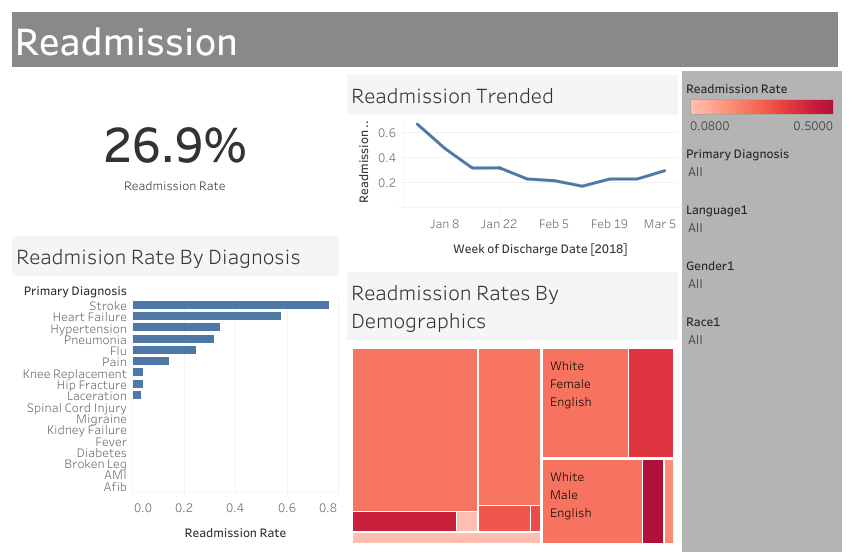
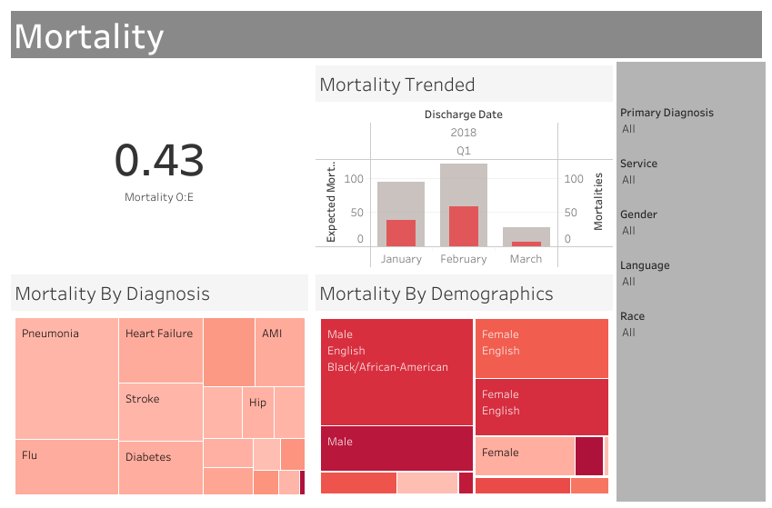

# Tableau for Healthcare

I took on this project to improve my visualisations skills on Tableau, especially on making interactive dashboards. I created these dashboards with the guidance of the Udemy eLearning course, Tableau for Heallthcare. This course has allowed me to gain a better understanding on how to make healthcare dashboards more compelling and informative, focusing on the quality rather than the complexity.

It is currently a work in progress, reflecting my ongoing journey through the course. The interactive dashboards I've worked on are based on simulated hospital datasets that contain information such as admission dates, discharge dates, blood pressure readings, and detailed patient demographics.

As I continue to advance, I look forward to exploring more concepts and refining these dashboards to offer a comprehensive understanding of healthcare analytics.

## Dataset

The dataset can be found as part of the Udemy course, [Tableau For Healthcare](https://ibmcsr.udemy.com/course/tableau-for-healthcare/learn/lecture/20464431#overview).

## Visualisation

### 1. Patients' Length of Stay
The length of a patient's stay serves as a valuable metric for assessing a hospital's efficiency. This dashboard leverages key performance indicators (KPIs), including the average Length of Stay (LOS) as a benchmark, the trend in LOS and weekly discharge counts from January to March, and the Observed:Expected Ratio, providing a comprehensive insight into hospital performance.

 

### 2. Patients' Readmission

 

### 3. Emergency Department Throughput

 

### 4. Mortality

 

### 5. Ambulatory Access

 

### 6. Hypertension Management

 

## Interactive Dashboards

To view and interact with the webpage created to showcase the dashboard(s), click the title(s) below:

[Patients' Length of Stay](https://nuralyaw.github.io/Tableau-for-Healthcare/)

## Acknowledgements

 - [Udemy Course: Tableau For Healthcare](https://ibmcsr.udemy.com/course/tableau-for-healthcare/learn/lecture/20464451#overview)
- [Tableau Embedding](https://github.com/dinkwiz/tableau_embed)

